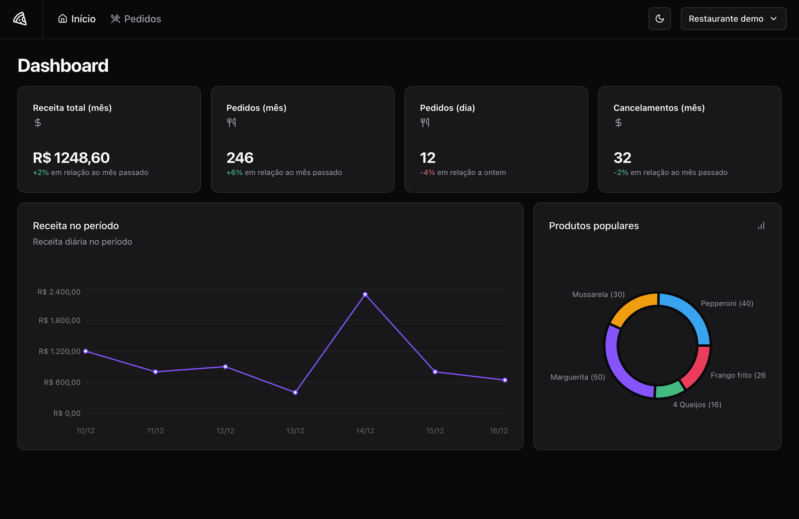

# Ignite Pizza Shop frontend

### Backend

[PizzaShop api](https://github.com/rocketseat-education/pizzashop-api)

- brew install oven-sh/bun/bun
- docker compose up -d
- bun i
- bun migrate
- bun seed
- bun dev
